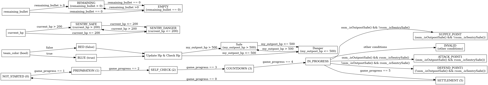

# rm_sentry_FSM

## 描述
上海工程技术大学木鸢Birdiebot战队自主开发的，用于机甲大师超级对抗赛RMUC的哨兵决策状态机

## 状态机结构


## 声明
状态机目前还在开发中，请不要clone下来使用，大家看个乐呵就行
(PS:开发者为大一新生，写代码水平比较屎，勿喷)

## 环境配置

当前开发环境为Ubuntu22.04，ROS Humble

## 编译

```
cd rm_sentry_FSM
colcon build --symlink-install
source install/setup.sh
```

## 使用方法

### 开启虚拟裁判系统话题发布

```
./rm_sentry_FSM/rm_decision_interfaces/publish_script.sh
```

### 启动状态机
```
ros2 run rm_sentry_FSM rm_sentry_FSM
```
